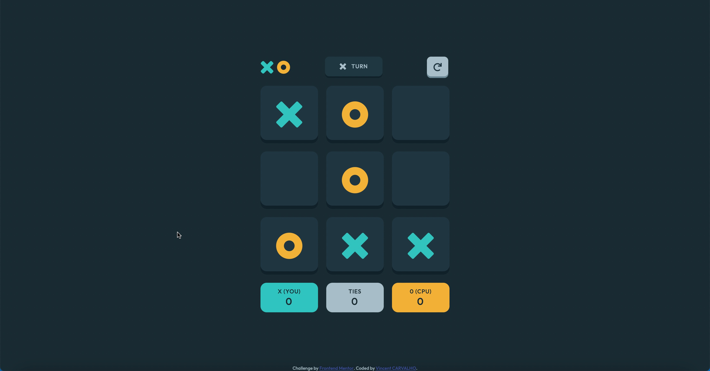

# Frontend Mentor - Tic Tac Toe solution

This is a solution to the [Tic Tac Toe challenge on Frontend Mentor](https://www.frontendmentor.io/challenges/tic-tac-toe-game-Re7ZF_E2v). Frontend Mentor challenges help you improve your coding skills by building realistic projects. 

## Table of contents

- [Overview](#overview)
  - [The challenge](#the-challenge)
  - [Screenshot](#screenshot)
  - [Links](#links)
- [My process](#my-process)
  - [Built with](#built-with)
  - [What I learned](#what-i-learned)
  - [Continued development](#continued-development)
  - [Useful resources](#useful-resources)
- [Author](#author)

## Overview

### The challenge

Users should be able to:

- View the optimal layout for the game depending on their device's screen size
- See hover states for all interactive elements on the page
- Play the game either solo vs the computer or multiplayer against another person
- **Bonus 1**: Save the game state in the browser so that it’s preserved if the player refreshes their browser
- **Bonus 2**: Instead of having the computer randomly make their moves, try making it clever so it’s proactive in blocking your moves and trying to win

### Screenshot

### Links

- Solution URL: [https://github.com/CarvalhoVincent/TicTacToe-game]
- Live Site URL: [https://carvalhovincent.github.io/TicTacToe-game/]

## My process

### Built with

- Semantic HTML5 markup
- CSS custom properties
- Flexbox
- CSS Grid
- Mobile-first workflow
- Minimax algorythm

### What I learned

I learned to use SVGs differently than I usually do with the img tag, so I can change colors easily. I also learned to better understand arrays and manipulate them to find the results needed to check for victory for this game. I used promises and "async await" for the first time. I discovered the Minimax algorithm to make the computer smarter so it plays the best moves.

### Continued development

I would like to continue to progress in javascript because I think that even if my code works it is not optimized.

### Useful resources

- [https://www.w3schools.com] - Used it for some reminders about CSS and JS.
- [https://stackoverflow.com/] - Used it for some reminders, and problems that I have.
- Minimax algorythm

## Author

- Frontend Mentor - [@CarvalhoVincent](https://www.frontendmentor.io/profile/CarvalhoVincent)

